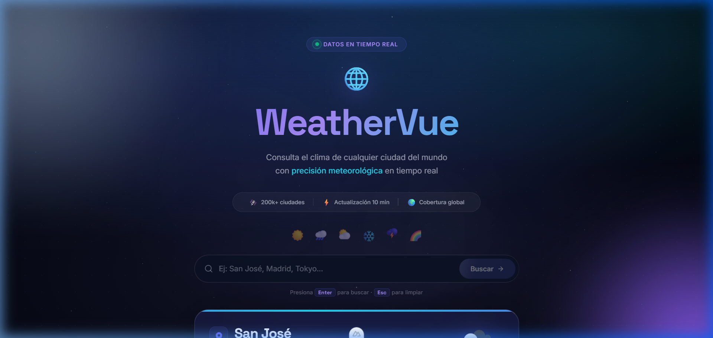
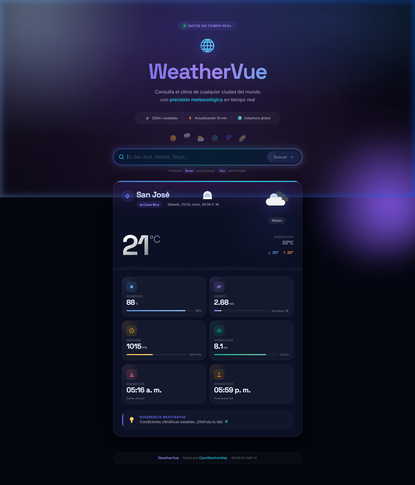
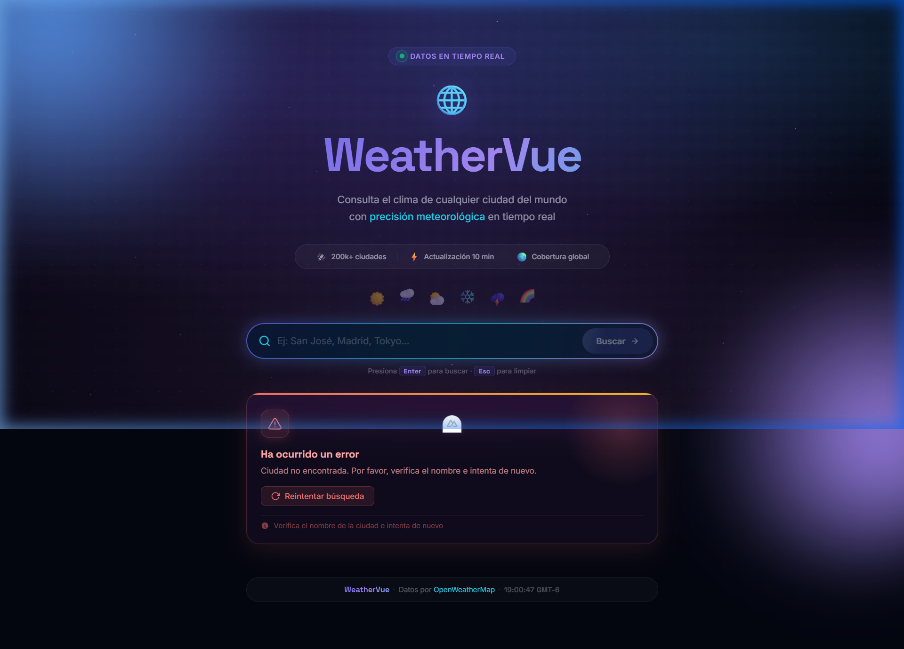

# WeatherVue - Proyecto Académico Nuxt 4

Aplicación web meteorológica de alta fidelidad desarrollada con **Nuxt 4**, **Vue 3**, **TypeScript** y **Composition API**, que permite consultar el clima actual de cualquier ciudad utilizando la API de OpenWeatherMap.

---

## 🚀 Tecnologías Utilizadas

- **Framework**: Nuxt 4 (Compatibility Version: 4)
- **Librería UI**: Vue 3
- **Lenguaje**: TypeScript (Strict Mode)
- **Estilos**: CSS Puro (Custom Properties, Flexbox, Grid, Glassmorphic Glass-morphism)
- **API**: OpenWeatherMap API (Current Weather Data 2.5)

---

## 📋 Características Implementadas (Funcionalidades Obligatorias)

1. **Buscador de Ciudad**: Campo de entrada con soporte para búsquedas interactivas mediante botón de buscar, tecla `Enter` y selección de sugerencias rápidas.
2. **Visualización de Métricas del Clima**:
   - Temperatura y Sensación Térmica
   - Descripción meteorológica detallada en español
   - Humedad relativa (%)
   - Velocidad del viento (m/s) y dirección cardinal animada (🧭, ↗️, ➡️, ↘️, etc.)
   - Icono oficial renderizado en alta definición
   - Horarios de Amanecer y Atardecer calculados según la hora local de la ciudad
3. **Historial de las Últimas 5 Búsquedas**: Historial de búsqueda dinámico que almacena hasta 5 consultas consecutivas sin duplicados (case-insensitive), persistido de forma segura en `localStorage` y con opción de eliminar entradas de forma individual (`×`) o limpiar todo.
4. **Estado de Carga (Loading State)**: Spinner y barra de progreso de alta gama basados en animaciones CSS (radar pulsante y barras con efecto shimmer) para retroalimentar la carga de datos.
5. **Manejo de Errores Amigables**: Control inteligente de errores de red, ciudad no encontrada (404), API Key desconfigurada (401/500) y reintentos automáticos.
6. **Persistencia**: Sincronización transparente con `localStorage` en el cliente.
7. **Diseño Responsive**: Interfaz adaptiva (Mobile First) que funciona en móviles, tablets y computadoras de escritorio.

---

## 💡 Conceptos Clave de Nuxt 4 Utilizados

- **Nuxt 4 Directory Structure**: Utiliza la configuración y el estándar de carpetas de Nuxt 4 (con retrocompatibilidad mediante `compatibilityVersion: 4` en `future`).
- **Composition API & Auto-Imports**: Implementación limpia de reactividad con `ref`, `computed`, `onMounted`, `useState` y `useHead` sin necesidad de importar manualmente cada dependencia de Vue o Nuxt.
- **Composables**: Abstracción modular del estado global y la lógica de negocio con `useWeather` y `useSearchHistory`.
- **RuntimeConfig**: Acceso seguro a las claves privadas de servidor y variables públicas desde el cliente.
- **Server API Routes**: Endpoint local en `/api/weather` que actúa como Proxy seguro para esconder la API Key de OpenWeatherMap del cliente final.
- **SSR / CSR Hybrid Behavior**: Carga inicial del framework del lado del servidor (SSR) combinada con hidratación y almacenamiento persistente (localStorage) en el cliente (CSR) mediante banderas seguras `import.meta.client`.

---
## 📚 ¿Qué es Nuxt 4 y cómo funciona?

Nuxt 4 es un framework de desarrollo web moderno construido sobre Vue.js que permite crear aplicaciones escalables, organizadas y de alto rendimiento. Su objetivo principal es simplificar el desarrollo mediante una estructura basada en convenciones, reduciendo la necesidad de configuraciones manuales y facilitando el mantenimiento del código.

A diferencia de utilizar Vue.js de forma tradicional, Nuxt incorpora herramientas integradas para el manejo de rutas, componentes, consumo de APIs, renderizado híbrido y configuración del servidor. Gracias a esto, los desarrolladores pueden enfocarse más en la lógica de negocio y menos en tareas de infraestructura.

### Arquitectura utilizada en este proyecto

La aplicación sigue la arquitectura multipágina y modular recomendada por Nuxt 4:

* **pages/**: Define automáticamente el enrutamiento de la aplicación:
  - `pages/index.vue`: Página principal (Home) estilo Landing Page SaaS.
  - `pages/weather.vue`: Aplicación meteorológica interactiva con todas las funcionalidades de consulta.
* **components/**: Componentes interactivos reutilizables:
  - `components/AppNavbar.vue`: Menú superior de navegación global.
  - `components/HomeHero.vue`: Banner principal de presentación con llamadas a la acción (CTA).
  - `components/FeaturesSection.vue`: Desglose visual de características y ventajas en formato grid.
  - `components/FooterSection.vue`: Pie de página académico integrado.
  - Componentes meteorológicos existentes (`SearchBar.vue`, `WeatherCard.vue`, `SearchHistory.vue`, `LoadingSpinner.vue`, `ErrorMessage.vue`).
* **composables/**: Centraliza la lógica de negocio reutilizable (`useWeather` y `useSearchHistory`).
* **server/api/**: Proxy seguro ejecutado en servidor (`weather.get.ts`) para proteger la API Key.
* **assets/**: Estilos globales encapsulados (`index.css`).
* **types/**: Interfaces estrictas TypeScript (`weather.ts`).

Esta organización facilita la escalabilidad y el mantenimiento del proyecto.

### Renderizado Híbrido (SSR + CSR)

Nuxt permite combinar renderizado del lado del servidor (SSR) y renderizado del lado del cliente (CSR).

En este proyecto:

* El framework genera la aplicación utilizando SSR para optimizar la carga inicial.
* La información meteorológica y el historial utilizan CSR para interactuar dinámicamente con el usuario.
* El almacenamiento local se maneja mediante `localStorage`, disponible únicamente del lado cliente.

Este enfoque híbrido permite obtener un buen rendimiento sin sacrificar interactividad.

### Consumo de API en Nuxt 4

La aplicación consume información meteorológica desde OpenWeatherMap utilizando una arquitectura segura basada en Server API Routes.

El flujo de funcionamiento es el siguiente:

1. El usuario ingresa una ciudad.
2. El frontend envía una solicitud al endpoint interno `/api/weather`.
3. Nuxt procesa la solicitud desde el servidor.
4. El servidor consulta OpenWeatherMap utilizando la API Key privada.
5. OpenWeatherMap responde con datos en formato JSON.
6. Nuxt devuelve únicamente la información necesaria al cliente.
7. La interfaz actualiza automáticamente los resultados gracias al sistema reactivo de Vue.

Este enfoque evita exponer la API Key en el navegador y mejora la seguridad de la aplicación.

### Manejo de Estados

Durante el consumo de la API se implementan tres estados fundamentales:

#### Estado de carga (Loading)

Mientras se espera la respuesta del servidor se muestra un spinner animado y una barra de progreso visual para informar al usuario que la consulta se encuentra en ejecución.

#### Estado de error

Si ocurre un problema como una ciudad inexistente, una falla de red o un error de autenticación, el sistema muestra mensajes amigables para facilitar la recuperación.

#### Estado exitoso

Cuando la solicitud finaliza correctamente, los datos se almacenan en estructuras reactivas y la interfaz se actualiza automáticamente sin necesidad de recargar la página.

### Seguridad de la API Key

La API de OpenWeatherMap requiere una API Key para autorizar las solicitudes.

Por motivos de seguridad:

* La clave no se almacena en el código fuente.
* La clave no se expone en el navegador.
* La clave se almacena mediante variables de entorno (`.env`).
* El acceso se realiza mediante `runtimeConfig`.
* Las consultas externas se ejecutan únicamente desde el servidor.

Este mecanismo protege las credenciales y sigue las buenas prácticas recomendadas para aplicaciones modernas.

### Casos de uso de Nuxt 4

Nuxt es ampliamente utilizado para desarrollar:

* Sitios web empresariales.
* Aplicaciones SaaS.
* Dashboards administrativos.
* Sistemas de comercio electrónico.
* Blogs y periódicos digitales.
* Aplicaciones Full Stack con frontend y backend integrados.

Su flexibilidad y rendimiento lo convierten en una de las soluciones más utilizadas dentro del ecosistema Vue.

---

## ⚖️ Ventajas y Desventajas de Nuxt 4

### Ventajas
1. **Seguridad Nativa**: El uso de Server Routes proxy (`server/api/`) oculta y protege la API Key en el servidor, evitando filtraciones en el frontend.
2. **Rendimiento de Carga (SSR)**: La página inicial se pre-renderiza en el servidor, agilizando el primer despliegue en pantalla (First Contentful Paint) y mejorando el SEO.
3. **Auto-Imports Eficientes**: Ahorra líneas de código repetitivo al importar automáticamente composables, componentes y helpers de Vue.
4. **Tipado Estricto de Extremo a Extremo**: Compatibilidad nativa con TypeScript y auto-generación de interfaces en la carpeta `.nuxt/`.

### Desventajas
1. **Acceso Limitado a Web APIs en SSR**: Elementos globales del cliente como `window`, `document` o `localStorage` no existen en la carga de servidor y deben ser condicionados bajo `import.meta.client` o ganchos `onMounted`.
2. **Complejidad Inicial**: Curva de aprendizaje superior a una SPA clásica debido a la gestión compartida de estado entre servidor y cliente.
3. **Mayor Consumo de Recursos en Servidor**: El pre-renderizado bajo demanda requiere un servidor de Node.js o una plataforma Serverless activa, a diferencia de una SPA estática ordinaria.

---

## 🛠️ Instalación y Configuración

1. **Clonar repositorio e instalar dependencias**:
   ```bash
   npm install
   ```

2. **Instrucciones para la API Key de OpenWeatherMap**:
   - Regístrate en [OpenWeatherMap](https://openweathermap.org/) y obtén tu API Key gratuita.
   - Crea un archivo llamado `.env` en la raíz del proyecto.
   - Agrega tu clave en el archivo con el siguiente formato:
     ```env
     NUXT_OPENWEATHER_API_KEY=tu_api_key_aqui
     OPENWEATHER_API_KEY=tu_api_key_aqui
     ```
   *(Nota: La API Key está protegida por la propiedad `runtimeConfig` en `nuxt.config.ts` y nunca llegará al navegador de los clientes).*

3. **Ejecución en Entorno Local (Desarrollo)**:
   ```bash
   npm run dev
   ```
   Abre [http://localhost:3000](http://localhost:3000) en tu navegador para interactuar con la aplicación.

4. **Construcción y Compilación para Producción**:
   ```bash
   npm run build
   ```

---

## 📸 Capturas de Pantalla (Estados de la Aplicación)

### 1. Buscador Principal en su Estado Inicial (Vacío)
Muestra la interfaz inicial con fondo atmosférico estrellado y chips de sugerencias rápidas para Costa Rica y otras capitales globales.


### 2. Tarjeta de Clima - San José, Costa Rica
Renderizado de la tarjeta meteorológica con hora local calculada, badge nacional traducido, dirección del viento, amanecer/atardecer local y el banner dinámico de sugerencias.




### 3. Estado de Carga (Loading Radar Spinner)
Spinner interactivo con círculos de radar pings en CSS puro y barra shimmer progresiva.


### 4. Mensaje de Error Amigable (Ciudad No Encontrada)
Mensaje de error personalizado en español con opción de reintento directo.

